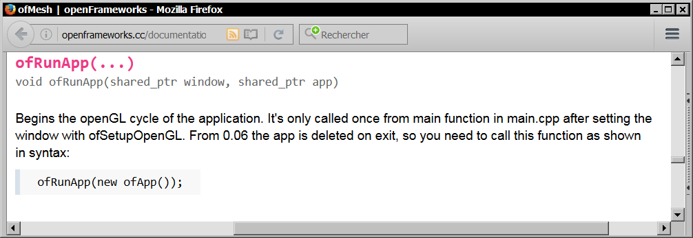

# OpenFrameworks Documentation shortcut

## Synopsis

This python 2.7 script can help you to jump directly from your text editor to the OF documentation.

## Usage example ( Code::Blocks )

- Place the insertion point on an OF keyword (a global function or a class name)
- Call the script, with the menu or a keyboard shortcut ( Alt-O in this case )

This lead you to the right documentation entry in your web browser:

## Requirement
You need to have Python 2.7 installed.

## Installation
Put the script somewhere, for example *C:\Users\username\Documents\python\OF doc*

Edit *open-documentation.py* to set the correct path, and eventually the OF documentation URL:

You should now be able to use the tool with a command line to find an OF keyword in the documentation:

This should open your web browser pointed to the right place, the ofSetColor documentation.
- If this doesn't work, read the documentation at the beginning of *open-documentation.py*
- If the command output is *"Item not found in the documentation"*, perhaps you need to generate the index for your current OF version. In this case read the beginning of *generate-index.py*, and use it to generate the index.

## Editor configuration ( Code::Blocks )
You can now configure your code editor to use the script and be able to show you the documentation for a selected keyword.

Here's an example for Code::Blocks 12.11, but this should work with any editor which allow to run shell commands.

First, add the script in the Tools menu:

You can if you want assign a keyboard shortcut to this new tool:

You can now place the insertion point on an OF keyword (a global function or a class name), and see its documentation with this tool.

Invoque the tool either by the menu or its keyboard shortcut:

This lead you to the right documentation entry in your web browser:

