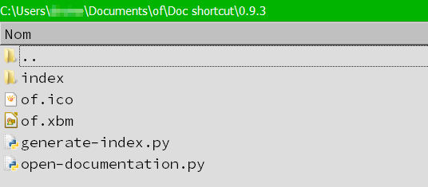

# OpenFrameworks Documentation shortcut

## Synopsis

This python 2.7 script can help you to jump directly from your text editor to the OF documentation.

 
 
 

## Usage example ( Qt Creator / Windows 7 )

- Select an OF keyword (a global function name, a class name, or a method of a class)

- Call the script, with the menu or a keyboard shortcut ( Ctrl-Alt-O in this case )

This lead you to the right documentation entry in your web browser:

- If the keyword is a method of a class, and if many classes have a method with this name, a
window popup to choose the class:

Choose the class, and press Enter (or Escape to cancel). This will display the documentation for
the method of this class.

 
 
 

## Requirement
You need to have Python 2.7 installed.

 
 
 

## Installation
Copy these files somewhere, for example *C:\Users\username\Documents\of\Doc shortcut\0.9.3*
- of.ico
- of.xbm
- generate-index.py
- open-documentation.py
- and the index folder

You should be able to use the tool with a command line to find an OF keyword in the online documentation:

This should open your web browser pointed to the right place, the ofSetColor documentation.

- If this doesn't work, read the documentation at the beginning of *open-documentation.py*
- If the command output is *"Item not found in the documentation"*, perhaps you need to generate the index for your current OF version. In this case read the beginning of *generate-index.py*, and use it to generate the index.

You can manually change the base URL for the documentation, for example to use a local copy of the documentation rather
than the online documentation. Just edit *open-documentation.py* to set the OF documentation URL:

  
  
 
 
 

## Editor configuration

You can now configure your code editor to use the script and be able to show you the documentation for a selected keyword.

Here's an example for Qt Creator 3.6.1, but this should work with any editor which allow to run shell commands.

First, add the script in the Tools menu:

You can if you want assign a keyboard shortcut to this new tool:

You can now select an OF keyword (a global function or a class name), and see its documentation with this tool.

Invoque the tool either by the menu or its keyboard shortcut:

This lead you to the right documentation entry in your web browser:

